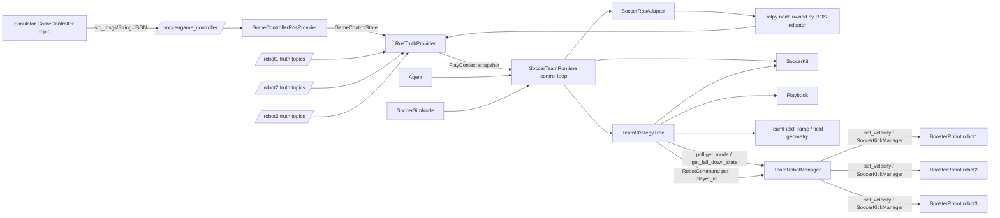
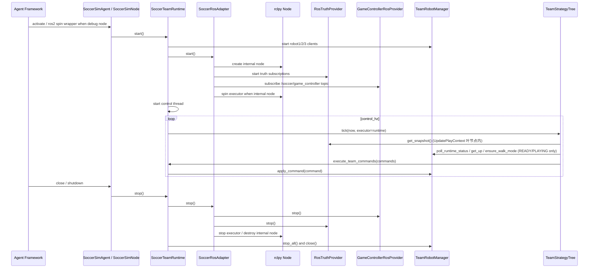
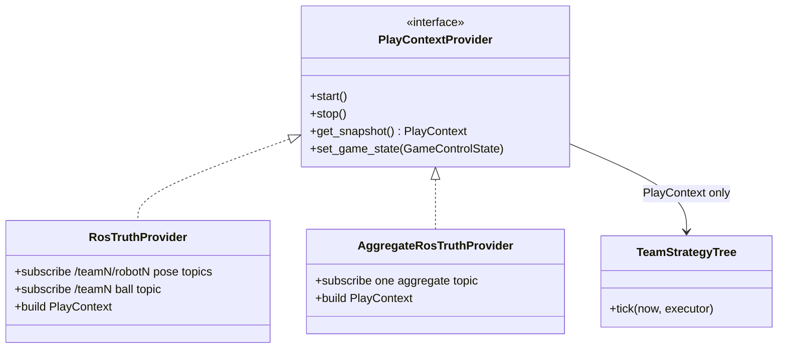
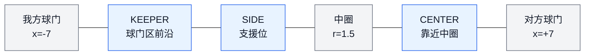
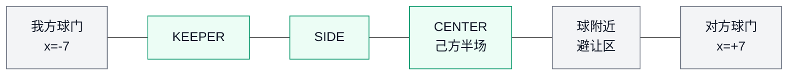
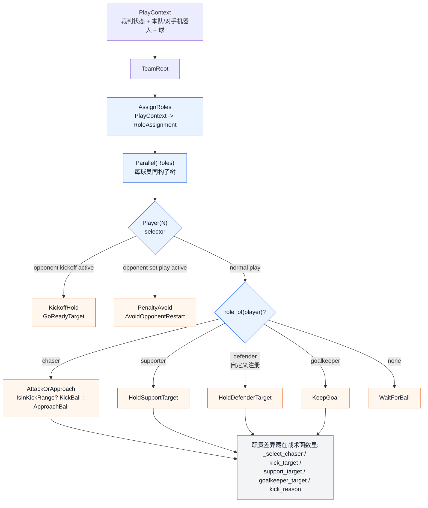

# SoccerSim 3v3 Agent 实现说明

本文档对应当前实现，用于代码 review 和仿真环境测试前快速理解整体结构。运行配置、启动命令、Docker 调试和仿真测试建议见 [operations.md](operations.md)；`src/` 代码地图见 [src/README.md](../src/README.md)。

## 1. 总体架构

当前实现把”框架入口”、”运行时适配”、”裁判状态判断”和”纯策略逻辑”分开：

- `src/soccer_framework/`：踢球环境框架包。开发者优先从这里导入 `PlayContext`、`RobotCommand`、`MoveIntent`、`KickIntent`、`SoccerConfig` 等数据/命令接口；ROS topic、GameController provider 和 boosteros 机器人对象封装在适配器内部。
- `src/main.py`：Booster Agent 入口。Agent 只保留生命周期入口，并把启动/关闭转发给共享 runtime。这个文件保留完整入口实现，避免启动语义藏在框架包内部。
- `src/runtime.py`：项目装配层 `SoccerKit` + `SoccerTeamRuntime`，把 framework 适配器、`TeamStrategyTree` 串起来跑控制循环；ROS node、订阅和 executor 生命周期下沉到 `SoccerRosAdapter`。framework 不会反向 import 这里。
- `src/soccer_framework/types.py`：纯数据类型 + `PlayContextProvider` 抽象。
- `src/soccer_framework/config.py`：`SoccerConfig` / `SoccerStrategyTuning` / `SoccerDebugConfig` 及 `from_env` 入口。
- `src/soccer_framework/game_state.py`：GameController JSON 编解码。
- `src/soccer_framework/ros_truth.py`：`RosTruthProvider`(环境观测适配器)。
- `src/soccer_framework/robot.py`：`TeamRobotManager` + `PlayerKickStateMachine`(机器人控制适配器)。
- `src/soccer_framework/game_controller.py`：`GameControllerRosProvider`(GC topic provider)。
- `src/soccer_framework/ros_adapter.py`：`SoccerRosAdapter`，统一持有 ROS node、truth provider、GameController provider、内部 executor 的启动和关闭。
- `src/soccer_framework/telemetry.py`：`SoccerLogger` 包装层和 JSONL 结构化日志插件；业务代码统一走 logger 接口。
- `src/tactics/`：纯模型对象。`geometry.py`（坐标变换 / 队伍视角场地几何 / 合法目标 clamp）、`targeting/`（射门 / 传球 / 支援 / restart / recovery 子模块）、`navigation.py`（避障与路径计算）、`motion.py`（行走 / 避障 / 踢球命令）、`kick_hysteresis.py`（踢球进 / 出场迟滞）、`ready_stance.py`（READY 站位）。
- `src/behavior_tree/`：BT 基础设施。`tree.py`（`TeamStrategyTree` 顶层装配 + `create_team_tree` 工厂）、`blackboard.py`（黑板 key 集中表 + `BlackboardClient`）、`ready_subtree.py` / `safety_subtree.py`（子树工厂）、`nodes/`（数据 / 条件 / 动作叶节点）。
- `src/play/`：PLAY 阶段策略（示例核心）。`playbook.py`（`Playbook` + `DefaultPlaybook` + chaser 评分）、`role.py` + `default_roles.py`（角色基类 + 默认动态职责）、`registry.py`（`PLAYBOOKS` 注册表）、`play_subtree.py`（PLAY 子树）、`nodes.py`（角色条件 + 动作叶）。
- `src/behavior_tree/tree.py` 的 `TeamStrategyTree` 是模板顶层门面：把 `SoccerKit` + `Playbook` + 行为树 root 装好，输入 `PlayContext`，经 `tick()` 驱动行为树，输出并执行每个机器人的 `RobotCommand`。
- `ros_debug/soccer_sim_debug/`：独立 ROS2 调试包。包内的 `soccer_sim_debug/ros_node.py` 行为平替 `SoccerSimAgent`，可用 `ros2 run` 启动；根目录不再作为 ROS 包暴露。
- `tests/test_soccer_framework_core.py`：覆盖纯策略和规则逻辑，不依赖 ROS、boosteros 或仿真环境。



核心边界是 `PlayContextProvider`。策略层和机器人控制层不拼 topic 名，也不关心 `/teamN/...` topic 前缀；这些细节只存在于 `RosTruthProvider` 中。

## 2. 类职责

### `src/main.py`

| 类 | 职责 |
| --- | --- |
| `SoccerSimAgent` | Booster Agent 入口。自身不直接订阅 ROS2 消息，也不持有 `rclpy` node；创建 `SoccerTeamRuntime`，激活时启动 runtime，关闭时停止 runtime 并关闭结构化日志。 |

### `ros_debug/soccer_sim_debug/soccer_sim_debug/ros_node.py`

| 类 | 职责 |
| --- | --- |
| `SoccerSimNode` | 独立 ROS2 调试包入口。通过 ROS 参数创建 `SoccerConfig`，然后启动同一套 `SoccerTeamRuntime`。这个包只用于命令行调试，不参与 Booster Agent 打包。 |

### `src/runtime.py`

| 类 | 职责 |
| --- | --- |
| `SoccerKit` | 队伍工具集。持有所有和具体打法无关的工具：场地坐标、规则判断、避障、踢球迟滞、READY 站位、移动 / 踢球命令输出层。BT 叶节点和 `Playbook` 直接通过 `kit.targeting` / `kit.motion` 等属性访问。 |
| `SoccerTeamRuntime` | 项目装配层。创建 `SoccerKit`、`Playbook`、机器人管理器、`SoccerRosAdapter`、`TeamStrategyTree`；`SoccerRosAdapter` 创建发生在 `TeamRobotManager` 初始化之后；启动控制循环；关闭时停止线程、ROS 适配层和机器人。 |

### `src/soccer_framework/ros_adapter.py`

| 类 | 职责 |
| --- | --- |
| `SoccerRosAdapter` | ROS 集成适配层。正常运行路径下创建内部 `sim_bridge` node、truth provider、GameController provider 和后台 `SingleThreadedExecutor`；低层外部传入 node 时只创建订阅，不接管 spin / destroy。 |

### `src/soccer_framework/ros_truth.py`

| 类 | 职责 |
| --- | --- |
| `RosTruthProvider` | v1 仿真真值适配器。订阅同一个 `/teamN` 视角下的本队机器人 pose、对手机器人 pose 和队伍级 `/teamN/.../ball`，并接收运行时轮询到的机器人状态，汇总成统一 `PlayContext`。 |

### `src/soccer_framework/game_controller.py`

| 类 | 职责 |
| --- | --- |
| `GameControllerRosProvider` | 裁判状态 provider。所有 Agent 都订阅 ROS2 topic 获取裁判状态，只消费仿真发布的 `/soccer/game_controller` topic；结构与 `RosTruthProvider` 一致，由 `SoccerRosAdapter` 统一 start / stop。 |

### `src/soccer_framework/robot.py`

| 类 | 职责 |
| --- | --- |
| `TeamRobotManager` | 管理 `BoosterRobot` 和对应 `SoccerKickManager`。对策略层只暴露运行状态轮询、起身/模式恢复和最终命令执行：`set_velocity`、`SoccerKickManager.start/update/stop`；soccer/walk mode 只在 READY/PLAYING 阶段需要行走命令时恢复。 |
| `PlayerKickStateMachine` | 封装单个球员的踢球通道，处理 `SoccerKickManager.start/update/stop`、最小活跃时间和底盘通道释放。 |

### `src/soccer_framework/types.py`

| 类型/类 | 职责 |
| --- | --- |
| `PlayContextProvider` | 数据来源抽象接口：`start()`、`stop()`、`get_snapshot()`、`set_game_state()`。后续换仿真真值格式只换 provider。 |
| `PlayContext` | 策略唯一输入，包含裁判状态、本队队友、对手机器人、球状态和更新时间。新鲜度过滤在行为树数据层统一完成（过期 `game_state`/`ball`/`pose` 置 None），策略层读到的就是已过滤快照。机器人硬件 mode / fall_down 由行为树数据层通过 `TeamRobotManager` 轮询，存独立黑板 key。 |
| `RobotRuntimeStatus` | 由运行时从机器人 API 轮询得到,包含当前 mode、倒地状态、是否可恢复和更新时间。 |
| `GameControlState` | 裁判状态的结构化表示，包含主状态、set play、队伍、球员处罚等。`last_seen_at` 记录最后一次收到 topic 的时间，用于数据层新鲜度过滤。 |
| `RobotCommand` | 机器人动作命令。`MoveIntent` 表示底盘速度，`KickIntent` 表示踢球方向/力度和机器人坐标系下的球位置，`StopIntent` 表示停止；`reason` 用于调试。 |

### `src/soccer_framework/config.py`

| 类型/类 | 职责 |
| --- | --- |
| `SoccerConfig` | 集中配置队伍、机器人名、对手机器人名、角色、控制频率、场地尺寸、策略调参和调试开关。 |
| `SoccerStrategyTuning` | 策略参数集合。包含传球评分阈值、绕障半径、推进距离、支援距离等；通过 dataclass 默认值、构造参数或 ROS 调试参数调整，不走环境变量。 |
| `SoccerDebugConfig` | 调试参数集合。当前包含行为树 tick trace 开关和采样间隔；通过 `SoccerConfig(debug=...)` 或 ROS 调试参数调整。 |

### `src/soccer_framework/game_state.py`

| 函数 | 职责 |
| --- | --- |
| `game_control_state_from_json` | 解析 `/soccer/game_controller` topic 的 JSON payload，生成 `GameControlState`。 |
| `game_control_state_to_json` | 把 `GameControlState` 序列化回 JSON,用于测试和复盘。 |

### `src/tactics/geometry.py`

| 类型/类 | 职责 |
| --- | --- |
| `TeamFieldFrame` | 按 `/teamN` ground truth 的队伍场地坐标系计算我方球门、对方球门、己方半场限制；同时提供场内目标 clamp 和重开球避让目标计算。避让半径统一读取 `SoccerConfig.strategy.opponent_restart_avoid_distance_m`。策略层固定使用 `+x` 进攻、`-x` 防守。 |

### `src/behavior_tree/tree.py`

| 类型/类 | 职责 |
| --- | --- |
| `TeamStrategyTree` | 模板顶层门面。每帧调用 `tick(now=None, executor=None)`，内部刷新行为树黑板并提交 `RobotCommand`。`now=None` 时默认用 `time.monotonic()`。 |
| `create_team_tree` | 构造完整队伍行为树 root + commit 节点的工厂；`TeamStrategyTree` 内部调用，单测里直接拼裸树时也能用。 |
| `RobotServices` | 行为树访问硬件服务的协议，当前由 `TeamRobotManager` 实现。 |

## 3. 运行生命周期



生命周期做了幂等保护：重复激活不会重复订阅或重复创建机器人；关闭时会先停控制线程，再停 ROS 适配层和机器人。

## 4. 运行配置

运行配置（环境变量、ROS 参数、Docker 调试脚本、启动命令）见 [operations.md](operations.md)。文档其余章节假定参赛者已经能把 Agent 跑起来。

## 5. 数据流与扩展点

### 当前 provider

`RosTruthProvider` 当前订阅的 topic 带队伍前缀。以 `team_id=1`、`robot_names=robot1,robot2,robot3`、`opponent_robot_names=robot4,robot5,robot6` 为例：

- `/team1/robot1/soccer/sim/ground_truth/robot_pose`
- `/team1/robot2/soccer/sim/ground_truth/robot_pose`
- `/team1/robot3/soccer/sim/ground_truth/robot_pose`
- `/team1/robot4/soccer/sim/ground_truth/robot_pose`
- `/team1/robot5/soccer/sim/ground_truth/robot_pose`
- `/team1/robot6/soccer/sim/ground_truth/robot_pose`
- `/team1/soccer/sim/ground_truth/ball`

位姿和球消息都按 `geometry_msgs/Pose2D` 读取。`robot_pose` 是每个机器人一个 topic；`ball` 是队伍内共享的队伍级 topic。`/teamN/...` topic 中的机器人位姿和球坐标已经相对队伍场地坐标系表达：对任意队伍，己方球门固定在 `x=-7.0`，对方球门固定在 `x=+7.0`，`+x` 是本队进攻方向，`-x` 是本队防守方向。仿真赛可以直接使用这些订阅真值，不需要策略或 runtime 额外做坐标系转换。

队伍场地坐标系不同于绝对场地坐标系。绝对场地坐标系会让两队共享同一个固定场地方向，因而 team1/team2 可能需要按阵营或半场处理镜像；队伍场地坐标系已经把这种差异折叠掉。provider 必须在同一个 `/teamN` topic 前缀下读取本队和对手机器人，不能切到 `/team{opponent}`；策略层不根据 `team_id`、上下半场或 topic 前缀翻转场地方向。若未来输入源改成绝对场地坐标，镜像/旋转应在 `PlayContextProvider` 适配层完成，进入 `PlayContext` 后仍保持队伍场地坐标系约定。

策略走向球时使用队伍场地坐标系；进入 `SoccerKickManager` 后，再把 `PlayContext.ball` 按当前机器人位姿转回机器人坐标系，传给 `update_ball()`。

也就是说，当前统一接口是：

```text
sim ground truth field ball
  -> PlayContext.ball
  -> strategy uses field ball for approach
  -> strategy converts field ball to robot-relative ball for SoccerKickManager.update_ball
```

### 未来单 topic 真值



如果仿真真值以后变成“一个 topic 发布所有机器人和球的位置”，新增 `AggregateRosTruthProvider` 即可。它只需要输出同样的 `PlayContext`，策略实现和 `TeamRobotManager` 不需要改。

## 6. 裁判机接入

裁判状态现在统一通过 ROS2 topic 进入策略层。运行时组件是 `GameControllerRosProvider`，由 `SoccerRosAdapter` 和 `RosTruthProvider` 一起装配：

- 每个 Agent 都订阅 `SOCCER_GAME_CONTROLLER_TOPIC`，默认 `/soccer/game_controller`。
- 仿真环境会自动向 `/soccer/game_controller` 发布裁判状态，Agent 只消费这个 ROS2 topic。

topic 订阅回调会通过 `game_control_state_from_json()` 反序列化 payload，然后写入 provider。新鲜度判断由行为树数据层内部 watchdog 统一完成：如果裁判状态、球或机器人位姿长时间没有刷新，DataLayer 会把对应字段置为 `None`。之后 `SafetyGuards` 在入口处处理这些无效输入，例如裁判状态缺失会触发 `StopAll("no game controller state")`，`PLAYING` 缺球会触发 `StopAll("waiting for ball")`。

仿真环境推荐保持默认配置：

```bash
SOCCER_GAME_CONTROLLER_TOPIC=/soccer/game_controller
```

## 7. 策略与规则层流转

策略入口是 `TeamStrategyTree.tick(now=None, executor=None)`。每一帧它把 `PlayContext` 写入行为树黑板，行为树生成 `dict[player_id, RobotCommand]`，最后通过 runtime 的 `execute_team_commands()` 执行或记录命令。

每个控制 tick 都进入同一棵队伍级 `py_trees` 行为树。顶层是 `Sequence`：先把外部输入写进黑板，再选当前应走哪个比赛阶段，再用按球员独立的 SafetyOverrides 修补本帧 `/cmd/{player_id}`，最后统一把命令交给 executor。

```text
Sequence(TeamRoot, memory=False)
  ├── Sequence(DataLayer)
  │     ├── UpdateClock
  │     ├── UpdatePlayContext           # 直接从 PlayContextProvider snapshot 写到黑板
  │     ├── UpdateGameState             # watchdog 过期则置 None
  │     ├── UpdateRecentBall            # watchdog 过期则置 None
  │     ├── UpdateRobotPoses            # watchdog 过期则把 pose 置 None
  │     └── UpdateRobotStatus(N)        # 写入每个球员的 RobotRuntimeStatus
  ├── Selector(MatchControl)
  │     ├── Selector(SafetyGuards)
  │     │     ├── Sequence(¬HasGameState → StopAll "no game controller state")
  │     │     ├── Sequence(IsAllPlayersInactive → StopAll "all players inactive")
  │     │     ├── Sequence(IsGameStopped → StopAll "game stopped")
  │     │     ├── Sequence(IsNonPlayingState → StopAll "non playing state")
  │     │     └── Sequence(IsGameInState(PLAYING) + ¬IsBallKnown → StopAll "waiting for ball")
  │     ├── Sequence(ReadyPhase)
  │     │     ├── IsGameInState(READY)
  │     │     └── Parallel(ReadySlots)         # 每球员一个 GoReadyTarget
  │     ├── Sequence(PlayingPhase)
  │     │     ├── IsGameInState(PLAYING)
  │     │     └── Sequence(PlaybookCore)
  │     │           ├── AssignRoles            # 写 PLAY 动态 RoleAssignment 到 /team/roles
  │     │           └── Parallel(Roles)        # 每球员一棵同构角色子树
  │     └── StopAll("unsupported state")
  ├── Parallel(SafetyOverrides)               # 每球员独立的 PlayerSafety
  │     └── Sequence(PlayerSafety(N))
  │           ├── Selector(AllowedGuard(N))
  │           │     ├── IsGlobalSafetyActive
  │           │     ├── Sequence(IsPlayerDisallowed → StopPlayer "inactive or penalized")
  │           │     └── AlwaysSuccess
  │           ├── Selector(FallDownGuard(N))
  │           │     ├── Sequence(IsRobotFallen → TriggerGetUp → StopPlayer "fall down recovery")
  │           │     └── AlwaysSuccess
  │           └── Selector(WalkModeGuard(N))
  │                 ├── Sequence(IsNotWalkMode → IsWalkModeRequired → TriggerEnterWalkMode)
  │                 └── AlwaysSuccess
  └── CommitTeamCommands
```

每个角色子树是同构的，区别只在战术目标函数里：

```text
Selector(Player(player_id))
  ├── Sequence(KickoffHold, IsOpponentKickoffActive → GoReadyTarget)
  ├── Sequence(PenaltyAvoid, IsOpponentRestartActive → AvoidOpponentRestart)
  ├── Sequence(IsRoleChaser, AttackOrApproach)
  │          # AttackOrApproach = Selector( Sequence(IsInKickRange, KickBall), ApproachBall )
  ├── Sequence(IsRoleSupporter, HoldSupportTarget)
  ├── Sequence(IsRoleGoalkeeper, KeepGoal)
  ├── Sequence(IsRoleDefender, HoldDefenderTarget)   # 仅自定义 Playbook 显式注册时出现
  └── WaitForBall
```

默认动态职责共用上面这棵树；固定的始发位 / restart 槽位由 `ReadySlot(center/side/keeper)` 表达，PLAY 中的 chaser / supporter / goalkeeper 差异则藏在 `Playbook.assign_roles`、`support_target`、`kick_target` 等方法返回的目标点里。它们统一接收 `PlayContext`（本帧已过滤的比赛、机器人和球快照）。`SafetyGuards` 已经保证 PLAY 战术层有有效的 GameController 和球，因此策略代码使用 `context.known_game` / `context.known_ball` 表达这个入口不变量。相关实现见 [src/soccer_framework/types.py](../src/soccer_framework/types.py)、[src/play/playbook.py](../src/play/playbook.py) 和 [src/tactics/](../src/tactics/)。`IsInKickRange` 的进 / 出场距离由 [src/tactics/kick_hysteresis.py](../src/tactics/kick_hysteresis.py) 维护。

树节点只负责”当前该走哪个全队分支”、刷新必要数据、按角色写入 `RobotCommand`，以及在摔倒 / 非 walk mode 时按球员独立覆盖或恢复命令。抢球仲裁、传球评分、支援位、restart 安全目标和避障分别落在 `play/` 与 `tactics/` 下的纯模型对象里。

```mermaid
stateDiagram-v2
    [*] --> NoGame
    NoGame --> StopAll: game_state is None

    [*] --> TeamRoot: game_state exists
    TeamRoot --> InactiveAll: all players penalized/inactive
    InactiveAll --> StopAll

    TeamRoot --> Stopped: stopped=true
    Stopped --> StopAll

    TeamRoot --> NonPlaying: TIMEOUT / INITIAL / SET / FINISHED
    NonPlaying --> StopAll

    TeamRoot --> Ready: state == READY
    Ready --> ReadyCommands: TeamFieldFrame targets

    TeamRoot --> NoBall: state == PLAYING and ball is None
    NoBall --> StopAll

    TeamRoot --> Playing: state == PLAYING
    Playing --> RoleParallel: AssignRoles + per-player selectors
    RoleParallel --> KickoffHold: opponent kickoff active
    RoleParallel --> PenaltyAvoid: opponent set play active
    RoleParallel --> RoleBranch: RoleAssignment.role_of(player)
    RoleBranch --> AttackOrApproach: chaser
    RoleBranch --> HoldSupportTarget: supporter
    RoleBranch --> KeepGoal: goalkeeper
    RoleBranch -.自定义注册.-> HoldDefenderTarget: defender
    RoleBranch --> WaitForBall: none
```

处理顺序是“先刷新黑板数据，再按裁判状态和球员分支选择动作”：

1. 没有裁判状态：所有机器人停止。
2. 输出全队命令前统一过滤被裁判处罚的球员；被处罚机器人停止，不影响其他球员继续按队伍计划执行。
3. `stopped=true`：所有机器人停止，避免 stopped motion 处罚。
4. `TIMEOUT`、`INITIAL`、`SET`、`FINISHED`：所有机器人停止。
5. `PLAYING` 但没有球：所有机器人停止等待球数据恢复；PLAY 战术层不会看到 `ball=None`。
6. `READY`：根据 `TeamFieldFrame` 计算合法站位，必要时避让球附近区域。READY 允许球暂时缺失。
7. `PLAYING`：先 `AssignRoles`，再由每个 `Player(N)` selector 独立判断对方 kickoff 保持 ready、对方定位球避让，最后才进入 chaser/supporter/goalkeeper 等常规角色分支。

策略保持简单，不额外跟踪己方多次触球；己方开球或间接重开球的进球有效性、出界、摆球、比分、处罚移出和回场仍由外部 GameController/仿真裁判负责。

### Kickoff / Restart 守卫

当前不再维护本地 restart 状态机，直接以 `GameControlState` 作为单一判断来源：

- 对方 kickoff 未开放球权：`IsOpponentKickoffActive` 要求 `state=PLAYING`、`set_play=NONE`、`secondary_time>0`、`kicking_team` 是对方。命中时该球员执行 `GoReadyTarget`，作为非开球方停留在 ready 位置，直到裁判机在对方触球或超时后清空 `kicking_team` / 倒计时。
- 对方定位球 / 重开球：`IsOpponentRestartActive` 调用 `SoccerKit.is_opponent_restart(game)`，要求 `state=PLAYING`、`stopped=false`、`set_play != NONE`、`kicking_team` 是对方。命中时该球员执行 `AvoidOpponentRestart`。
- 摆球暂停：`stopped=true` 由 `SafetyGuards` 全局写 `StopAll("game stopped")`，避免 stopped motion 处罚；PLAY 子树不会继续执行。

`AvoidOpponentRestart` 在 SafetyGuards 之后运行，所以可以假设 GameController 和球数据有效；自身位姿缺失时该球员停止等待。若该球员已经在 `SoccerConfig.strategy.opponent_restart_avoid_distance_m` 外，则直接停止，不再继续向外走；否则用 `Targeting.opponent_restart_target` 计算合法避让目标。默认避让距离是 `1.6m`，对应规则要求的 `1.45m` 加 `0.15m` 余量，统一从配置读取。

## 8. READY 策略

当前使用 `/teamN` ground truth 的队伍场地坐标系，场地中心是 `(0, 0)`：

- 场地长度/宽度：`14.0m x 9.0m`。
- 中圈半径：`1.5m`。
- 对每一队来说，己方球门都在 `x=-7.0`，对方球门都在 `x=+7.0`。
- 策略层固定 `+x` 进攻、`-x` 防守；`TeamFieldFrame` 不根据 `team_id` 或 `firstHalf` 翻转场地方向。
- 绝对场地坐标、左右场切换等输入差异只允许在 provider/adapter 层归一化，不进入策略层。

READY 目标不是固定绝对坐标，而是按 `ReadySlot`、己方半场和 restart 类型动态计算：

| ReadySlot | 我方 restart | 对方 restart |
| --- | --- | --- |
| `CENTER` | 在己方半场靠近中圈，准备触球；set play 时靠近球后方。 | 留在己方半场，若球在附近则按 `opponent_restart_avoid_distance_m` 避让，默认 `1.6m`。 |
| `SIDE` | 在中路槽位后方支援；set play 时站到球后方侧翼接应。 | 留在己方半场支援点，若球在附近则避让。 |
| `KEEPER` | 靠近己方球门区前沿。 | 靠近己方球门区前沿。 |

队伍场地坐标系下我方 restart READY 站位示意：



队伍场地坐标系下对方 restart READY 站位示意：



READY 阶段参考 `soccer-python` 的 `MotionController`：远距离使用 `far_turn_then_forward` 思路，先用 `vyaw` 朝向目标方向，角度误差小于阈值后主要用 `vx` 前进且 `vy=0`；近距离才进入 `near_omni`，用 `vx/vy` 做小范围平移微调；到达站位点后再原地转身，让机器人面向对方半场。这样避免把大段上场路径交给横移 `vy` 执行。

## 9. PLAYING 策略

进入 PLAYING 角色树前，`SafetyGuards` 已经处理 `stopped=true` 和缺球。PLAYING 阶段先分配角色，再由每个球员自己的 `Selector(Player(N))` 处理高优先级守卫：

- 对方 kickoff 球权尚未开放：非开球方走 `KickoffHold`，保持或回到 ready 位置。
- 对方定位球 / 重开球正在准备开球：非主罚方走 `PenaltyAvoid`，离球至少 `opponent_restart_avoid_distance_m`。
- 以上都不命中时，才进入 chaser/supporter/goalkeeper/defender 等常规角色战术。

己方 kickoff 或己方定位球暂不在策略层额外判断间接进球限制；进入 PLAYING 后按普通进攻/支援/防守逻辑处理，得分有效性由 GameController 负责。

PLAYING 动态职责行为总览：



### 动态职责子树执行细节

默认职责共用同一棵 `Selector(Chase / Support / Goalkeep / Wait)`。自定义 Playbook 显式注册 `DefenderRole` 后，会额外出现 defender 分支。`AssignRoles` 调用 `Playbook.assign_roles(ctx)` 写入 `RoleAssignment`，每帧只有分到 `chaser` 的球员能走到 `AttackOrApproach`：

- 没有球：由 `SafetyGuards` 在进入 PLAY 子树前全队停止，PLAY 战术层使用 `context.known_ball`。
- 没有自身位姿：具体移动 / 踢球节点返回失败，最终走到 `WaitForBall`，输出停止等待。
- 是 chaser 且 `IsInKickRange` 不通过：`ApproachBall` 用 `set_velocity` 走到球后方一个 `ReadySlot` 相关的偏移（`CENTER` / `SIDE` 为 `0.4m`，`KEEPER` 为 `0.22m`），朝向对方球门；队伍场地坐标系下球后方固定是 `ball.x - offset`。
- 是 chaser 且 `IsInKickRange` 通过：`KickBall` 输出 `KickIntent`，由 `TeamRobotManager` 启用 `SoccerKickManager`。`IsInKickRange` 内部维护带迟滞的入 / 出场距离（默认 `soccer_kick_enter_distance=2.5m`、`soccer_kick_exit_distance=3.0m`），避免球距在阈值附近抖动时频繁 start / stop（实现见 [src/tactics/kick_hysteresis.py](../src/tactics/kick_hysteresis.py)）。
- 分到 supporter：`HoldSupportTarget` 走到 `Playbook.support_target` 给出的支援位。
- 分到 defender：仅自定义 Playbook 显式注册时出现，`HoldDefenderTarget` 走到 `DefenderRole.target` 给出的防守位。
- 分到 goalkeeper：`KeepGoal` 走到 `Playbook.goalkeeper_target` 给出的门将守位。
- 进入 `SoccerKickManager` 后每个控制 tick 都会更新：
  - `update_ball(x=ball_x_in_robot_frame, y=ball_y_in_robot_frame)`
  - `update_command(direction=goal_direction_in_robot_frame, power=soccer_kick_power)`
- 当前为保持模板简单，己方开球进入 PLAYING 后不额外判断”两名不同球员触球后才允许进球”。

职责差异完全体现在 [src/play/default_roles.py](../src/play/default_roles.py) 的目标方法里：

- chaser 的 `kick_target` 按 `ReadySlot` 分流：`CENTER` 走 `Targeting.select_kick_target`（射门 / 传球评分），`SIDE` 走 `Targeting.select_clear_or_pass_target`（解围 / 传球），`KEEPER` 走 keeper clear。
- supporter 走 `Targeting.support_target`，站在球后方并按队友间距推开。
- goalkeeper 直接走 `kit.ready_stance.goalkeeper_guard_target(ball)`，基础点在己方球门前（`x = -field_length/2 + goal_area_length + 0.50`），按球的横向位置在球门前小幅平移：

  ```text
  y = clamp(ball.y * 0.38, -1.35, 1.35)
  ```

  避免第一版门将大范围离开门区。
