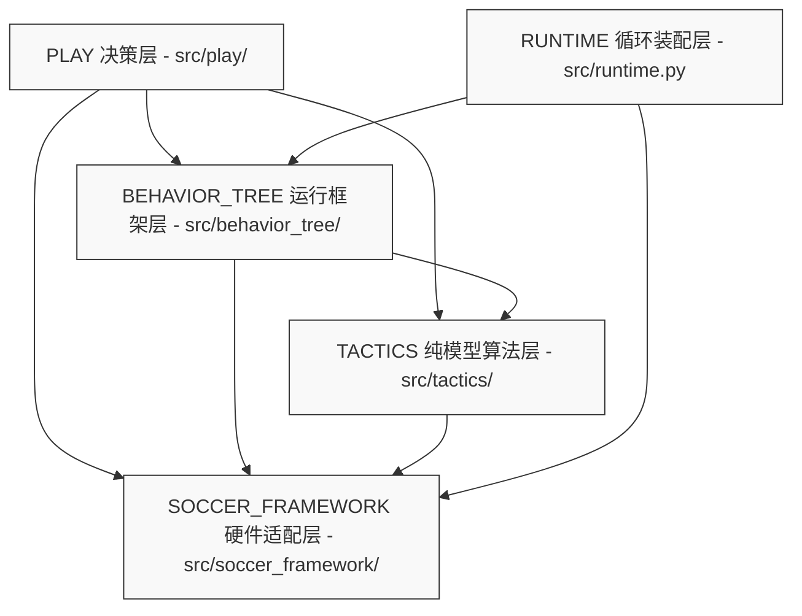
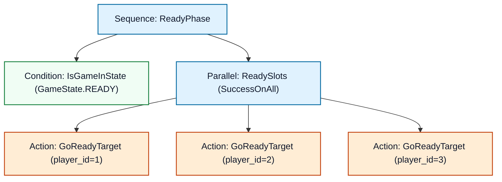
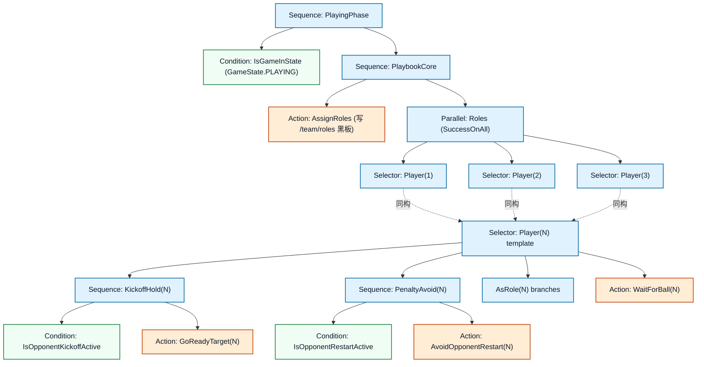

# SoccerSim 工程架构整理与完整行为树分析报告

本报告对 SoccerSim 工程的架构组织、目录职责、黑板数据流以及完整的 `py_trees` 行为树进行系统性的梳理和绘制，为后续的策略开发、调试 and 扩展提供全面的技术参考。

---

## 1. SoccerSim 工程目录结构与模块职责

SoccerSim 遵循**单向依赖**和**模型-执行分离**的设计理念，将整个机器人的控制和决策流程划分为以下四个清晰的层次：



### 1.1 模块目录一览表

| 目录/文件 | 核心职责 | 示例/开发修改指南 |
| :--- | :--- | :--- |
| [src/soccer_framework/](file:///home/ylb/BoosterStudioProjects/SoccerSim/src/soccer_framework/) | **硬件适配与环境通信**：定义 `PlayContext`, `RobotCommand`, `BallState` 等基础数据结构，处理裁判机 JSON 状态和 ROS2 消息的转换。不依赖任何上层目录。 | 参赛者原则上**保持不变**，仅作为公共 API 参考。 |
| [src/tactics/](file:///home/ylb/BoosterStudioProjects/SoccerSim/src/tactics/) | **纯数学/物理模型算法**：处理坐标几何与场地 clamp（`geometry.py`）、避障（`navigation.py`、`motion.py`）、对方重开球避让目标（`targeting/restart.py`）以及进攻射门 / 传球 / 支援目标点评分（`targeting/`）、踢球迟滞（`kick_hysteresis.py`）、READY 站位（`ready_stance.py`）。不包含行为树和 ROS 依赖。 | 需要修改底层平滑移动避障公式、射门角度选择或特定策略点计算时由此进入。 |
| [src/behavior_tree/](file:///home/ylb/BoosterStudioProjects/SoccerSim/src/behavior_tree/) | **队伍运行与行为树框架**：包含顶层行为树装配（`tree.py` 的 `TeamStrategyTree` + `create_team_tree`）、READY 阶段子树（`ready_subtree.py`）、安全防御与状态覆盖（`safety_subtree.py`）以及黑板配置（`blackboard.py`）。 | 通常保持不变，供策略层作为底层设施调用。 |
| [src/play/](file:///home/ylb/BoosterStudioProjects/SoccerSim/src/play/) | **★ 动态角色策略与打法核心**：实现具体的动态角色分配（`playbook.py`）、默认角色行为子树（`default_roles.py`、`role.py`）及追球决策评分（`playbook.py` 的 `DefaultPlaybook.select_chaser`）。 | **策略重构/编写的核心入口**。修改角色策略、添加新职责（如拦截者、退防防守者等）均在此目录进行。 |
| [src/runtime.py](file:///home/ylb/BoosterStudioProjects/SoccerSim/src/runtime.py) | **系统集成装配器**：把 `SoccerKit`、`Playbook`、`TeamStrategyTree` 串到 `SoccerTeamRuntime` 的控制循环中，驱动主控制流。 | 系统启动、多线程/多进程执行和异常排查入口。 |

### 1.2 黑板 (Blackboard) 数据流与通信机制

行为树的节点之间不进行直接的函数调用，而是通过全局 `py_trees.blackboard.Blackboard` 进行数据读写。黑板中集中管理的键（`BlackboardKeys`）如下：

* `/clock/now` (float)：当前 tick 对应的时间戳（秒）。
* `/play_context` (`PlayContext`)：当前帧的已过滤环境快照（包含裁判状态、本队队友、对手机器人坐标、球状态）。新鲜度过滤在数据层统一完成：过期的 `game_state`/`ball`/`pose` 被原地置为 None，策略层读到的就是已过滤值。
* `/team/roles` (`RoleAssignment`)：本帧通过 `AssignRoles` 算出的动态职责映射（例如：`{1: "chaser", 2: "supporter", 3: "goalkeeper"}`）。
* `/safety/active` (bool)：全局安全覆盖是否启用。
* `/robot_status/{player_id}` (`RobotRuntimeStatus`)：每台机器人的硬件运行状态（例如倒地状态、运动模式等）。
* `/cmd/{player_id}` (`RobotCommand`)：为各球员生成的指令槽，由匹配分支写入，然后由 `SafetyOverrides` 按需覆盖，最终由 `CommitTeamCommands` 一并下发。

---

## 2. SoccerSim 完整行为树图谱

整棵行为树可划分为**顶层控制骨架** and **PLAYING阶段角色子树**两部分。

为了更清晰地呈现全队行为树在单帧 Tick 时的执行流，以下给出了**细化到最末端叶子节点**的完整 Unicode 树形结构图（缩进层级代表父子节点依赖，标有 `(1)/(2)/(3)` 代表对应三位球员的同构展开结构）：

```text
Sequence(TeamRoot)
├── Sequence(DataLayer)                       ← 每一帧开始更新黑板数据
│   ├── UpdateClock                           ← 更新系统时间 /clock/now
│   ├── UpdatePlayContext                           ← 更新场地及位置真值 /play_context
│   ├── UpdateGameState                       ← 过滤 game_state 新鲜度，过期置 None
│   ├── UpdateRecentBall                      ← 过滤 ball 新鲜度，过期置 None
│   ├── UpdateRobotPoses                      ← 过滤 robot/opponent pose 新鲜度，过期置 None
│   ├── UpdateRobotStatus(1)                  ← 更新球员1状态 /robot_status/1
│   ├── UpdateRobotStatus(2)                  ← 更新球员2状态 /robot_status/2
│   └── UpdateRobotStatus(3)                  ← 更新球员3状态 /robot_status/3
│
├── Selector(MatchControl)                    ← 根据裁判状态和安全规则做核心决策
│   ├── Selector(SafetyGuards)                ← 全局安全状态守卫，有一项异常则强行停止全队
│   │   ├── Sequence(NoGameStop)
│   │   │   ├── ¬HasGameState (Inverter)      ← 无 GameController 状态包时命中
│   │   │   └── StopAll("no game ...")        ← 停止整队动作命令，写 Blackboard cmd 插槽
│   │   ├── Sequence(AllInactiveStop)
│   │   │   ├── IsAllPlayersInactive            ← 所有人罚下或离线时命中
│   │   │   └── StopAll("all players ...")    ← 停止整队
│   │   ├── Sequence(StoppedPlayStop)
│   │   │   ├── IsGameStopped                 ← 裁判 stopped=true
│   │   │   └── StopAll("game stopped")       ← 停止整队
│   │   ├── Sequence(NonPlayingStop)
│   │   │   ├── IsNonPlayingState             ← TIMEOUT / INITIAL / SET / FINISHED 阶段时命中
│   │   │   └── StopAll("non playing state")  ← 停止整队
│   │   └── Sequence(NoPlayingBallStop)
│   │       ├── IsGameInState(PLAYING)        ← PLAYING 需要有效球数据
│   │       ├── ¬IsBallKnown (Inverter)       ← 球缺失或过期
│   │       └── StopAll("waiting for ball")   ← 停止整队等待球数据恢复
│   │
│   ├── Sequence(ReadyPhase)                  ← 准备开球就位阶段
│   │   ├── IsGameInState(READY)              ← 仅在 READY 状态进入
│   │   └── Parallel(ReadySlots)              ← 并行控制每个球员走到准备点
│   │       ├── GoReadyTarget(1)              ← 球员 1 走到 READY 站位点
│   │       ├── GoReadyTarget(2)              ← 球员 2 走到 READY 站位点
│   │       └── GoReadyTarget(3)              ← 球员 3 走到 READY 站位点
│   │
│   ├── Sequence(PlayingPhase)                ← PLAYING 常规比赛阶段
│   │   ├── IsGameInState(PLAYING)            ← 仅在 PLAYING 状态进入
│   │   └── Sequence(PlaybookCore)            ← 战术博弈核心层
│   │       ├── AssignRoles(playbook)         ← 每帧运行 Playbook，写角色分工到 /team/roles
│   │       └── Parallel(Roles)               ← 三名球员角色对应的策略并行 Tick
│   │           ├── Selector(Player(1))       ← 同下方 Player(N) 模板
│   │           ├── Selector(Player(2))       ← 同下方 Player(N) 模板
│   │           └── Selector(Player(3))       ← 同下方 Player(N) 模板
│   │
│   │           Player(N) 模板：
│   │           ├── Sequence(KickoffHold(N))
│   │           │   ├── IsOpponentKickoffActive   ← 对方 kickoff 未开放球权
│   │           │   └── GoReadyTarget(N)          ← 非开球方保持 ready 位置
│   │           ├── Sequence(PenaltyAvoid(N))
│   │           │   ├── IsOpponentRestartActive   ← 对方定位球 / 重开球正在进行
│   │           │   └── AvoidOpponentRestart(N)   ← 过近时移动到避让目标，已安全则停止
│   │           ├── Sequence(AsChaser(N))
│   │           │   ├── IsRole<chaser>(N)
│   │           │   └── Selector(ChaserKickOrApproach(N))
│   │           │       ├── Sequence(ChaserKick(N))
│   │           │       │   ├── IsInKickRange(N)
│   │           │       │   └── ChaserKickAction(N)
│   │           │       └── ChaserApproachAction(N)
│   │           ├── Sequence(AsSupporter(N))
│   │           │   ├── IsRole<supporter>(N)
│   │           │   └── MoveToRoleTarget(N)
│   │           ├── Sequence(AsGoalkeeper(N))
│   │           │   ├── IsRole<goalkeeper>(N)
│   │           │   └── MoveToRoleTarget(N)
│   │           ├── Sequence(AsDefender(N))   ← 供扩展的自定义 defender 分支
│   │           │   ├── IsRole<defender>(N)
│   │           │   └── MoveToRoleTarget(N)
│   │           └── WaitForBall(N)            ← 没分到角色时的兜底动作叶
│   │
│   └── StopAll("unsupported state")          ← MatchControl 的最终兜底
│
├── Parallel(SafetyOverrides)                 ← 独立于 MatchControl 之外的硬件状态兜底层 (SuccessOnAll)
│   ├── Sequence(PlayerSafety(1))             ← 球员 1 的安全覆盖与修补
│   │   ├── Selector(AllowedGuard(1))
│   │   │   ├── IsGlobalSafetyActive          ← 全局安全控制是否激活
│   │   │   ├── Sequence(AllowedStop(1))
│   │   │   │   ├── IsPlayerDisallowed(1)     ← 球员是否被罚下或未出场
│   │   │   │   └── StopPlayer(1, "penalized")← 强制覆盖本帧命令为 Stop
│   │   │   └── Success                       ← 常规状态直接返回 Success
│   │   ├── Selector(FallDownGuard(1))
│   │   │   ├── Sequence(FallDownRecovery(1))
│   │   │   │   ├── IsRobotFallen(1)          ← 检测机器人是否处于跌倒状态
│   │   │   │   ├── TriggerGetUp(1)           ← 下发起身动作包
│   │   │   │   └── StopPlayer(1, "recovery")  ← 强制覆盖本帧移动命令为 Stop
│   │   │   └── Success
│   │   ├── Selector(WalkModeGuard(1))
│   │   │   ├── Sequence(WalkModeRecovery(1))
│   │   │   │   ├── IsNotWalkMode(1)          ← 当前未处于正常行走模式
│   │   │   │   ├── IsWalkModeRequired(1)   ← 上层指令本帧发出了移动命令
│   │   │   │   └── TriggerEnterWalkMode(1)   ← 强行覆盖为切行走模式包
│   │   │   └── Success
│   │   │
│   ├── Sequence(PlayerSafety(2))             ← 球员 2 的安全覆盖与修补
│   │   ├── Selector(AllowedGuard(2))
│   │   │   ├── IsGlobalSafetyActive
│   │   │   ├── Sequence(AllowedStop(2))
│   │   │   │   ├── IsPlayerDisallowed(2)
│   │   │   │   └── StopPlayer(2, "penalized")
│   │   │   └── Success
│   │   ├── Selector(FallDownGuard(2))
│   │   │   ├── Sequence(FallDownRecovery(2))
│   │   │   │   ├── IsRobotFallen(2)
│   │   │   │   ├── TriggerGetUp(2)
│   │   │   │   └── StopPlayer(2, "recovery")
│   │   │   └── Success
│   │   └── Selector(WalkModeGuard(2))
│   │       ├── Sequence(WalkModeRecovery(2))
│   │       │   ├── IsNotWalkMode(2)
│   │       │   ├── IsWalkModeRequired(2)
│   │       │   └── TriggerEnterWalkMode(2)
│   │       └── Success
│   │
│   └── Sequence(PlayerSafety(3))             ← 球员 3 的安全覆盖与修补
│       ├── Selector(AllowedGuard(3))
│       │   ├── IsGlobalSafetyActive
│       │   ├── Sequence(AllowedStop(3))
│       │   │   ├── IsPlayerDisallowed(3)
│       │   │   └── StopPlayer(3, "penalized")
│       │   │   └── Success
│       ├── Selector(FallDownGuard(3))
│       │   ├── Sequence(FallDownRecovery(3))
│       │   │   ├── IsRobotFallen(3)
│       │   │   ├── TriggerGetUp(3)
│       │   │   └── StopPlayer(3, "recovery")
│       │   └── Success
│       └── Selector(WalkModeGuard(3))
│           ├── Sequence(WalkModeRecovery(3))
│           │   ├── IsNotWalkMode(3)
│           │   ├── IsWalkModeRequired(3)
│           │   └── TriggerEnterWalkMode(3)
│           └── Success
│
└── CommitTeamCommands                       ← 收拢各球员插槽中最终修补后的指令，发送给机器人执行器
```

这是极为直观的可视化展现。以下是各个局部的详细 Mermaid 图和文字解析。

### 2.1 顶层行为树总览 (`TeamRoot`)

顶层树的每帧 Tick 执行流程如下：

```mermaid
graph TD
    Root["Sequence: TeamRoot (memory=False)"]

    %% 第一分支：数据层
    DataLayer["Sequence: DataLayer"]
    UpdateClock["Action: UpdateClock"]
    UpdatePlayContext["Action: UpdatePlayContext"]
    UpdateGameState["Action: UpdateGameState (过期置 None)"]
    UpdateRecentBall["Action: UpdateRecentBall (过期置 None)"]
    UpdateRobotPoses["Action: UpdateRobotPoses (过期置 None)"]
    UpdateStatusN["Action: UpdateRobotStatus(player_id) × N"]

    Root --> DataLayer
    DataLayer --> UpdateClock
    DataLayer --> UpdatePlayContext
    DataLayer --> UpdateGameState
    DataLayer --> UpdateRecentBall
    DataLayer --> UpdateRobotPoses
    DataLayer --> UpdateStatusN

    %% 第二分支：匹配选择层
    MatchControl["Selector: MatchControl"]
    SafetyGuards["Selector: SafetyGuards (全局状态守卫)"]
    ReadyPhase["Sequence: ReadyPhase (READY 阶段)"]
    PlayingPhase["Sequence: PlayingPhase (PLAYING 阶段)"]
    StopAllDefault["Action: StopAll (unsupported state)"]

    Root --> MatchControl
    MatchControl --> SafetyGuards
    MatchControl --> ReadyPhase
    MatchControl --> PlayingPhase
    MatchControl --> StopAllDefault

    %% 第三分支：安全覆盖层
    SafetyOverrides["Parallel: SafetyOverrides (SuccessOnAll)"]
    PlayerSafety["Sequence: PlayerSafety(player_id) × N"]

    Root --> SafetyOverrides
    SafetyOverrides --> PlayerSafety

    %% 第四分支：指令下发
    CommitTeamCommands["Action: CommitTeamCommands"]
    Root --> CommitTeamCommands

    classDef composite fill:#e0f2fe,stroke:#0369a1,stroke-width:1.5px,color:#0f172a;
    classDef decorator fill:#fae8ff,stroke:#a21caf,stroke-width:1.5px,color:#0f172a;
    classDef action fill:#ffedd5,stroke:#c2410c,stroke-width:1.5px,color:#0f172a;
    classDef condition fill:#f0fdf4,stroke:#15803d,stroke-width:1.5px,color:#0f172a;

    class Root,DataLayer,MatchControl,ReadyPhase,PlayingPhase,SafetyOverrides,PlayerSafety composite;
    class UpdateClock,UpdatePlayContext,UpdateGameState,UpdateRecentBall,UpdateRobotPoses,UpdateStatusN,StopAllDefault,CommitTeamCommands action;
    class SafetyGuards composite;
```



---

### 2.2 状态判定子树展开

#### A. 全局安全状态守卫 (`SafetyGuards`)
当裁判机状态不匹配、全队不可用、裁判暂停、非比赛状态，或 `PLAYING` 阶段缺少球数据时，`SafetyGuards` 选择器将强行拦截后续的 `ReadyPhase` 和 `PlayingPhase` 逻辑，停止全队运动。这样 PLAY 战术层可以假设 GameController 和球数据有效。

```mermaid
graph TD
    SafetyGuards["Selector: SafetyGuards"]

    %% 守卫1
    NoGameStop["Sequence: NoGameStop"]
    NotHasGameState["Decorator: ¬HasGameState (Inverter)"]
    HasGameState["Condition: HasGameState"]
    StopAll1["Action: StopAll (no game controller state)"]

    SafetyGuards --> NoGameStop
    NoGameStop --> NotHasGameState
    NotHasGameState --> HasGameState
    NoGameStop --> StopAll1

    %% 守卫2
    AllInactiveStop["Sequence: AllInactiveStop"]
    IsAllPlayersInactive["Condition: IsAllPlayersInactive"]
    StopAll2["Action: StopAll (all players inactive)"]

    SafetyGuards --> AllInactiveStop
    AllInactiveStop --> IsAllPlayersInactive
    AllInactiveStop --> StopAll2

    %% 守卫3
    StoppedPlayStop["Sequence: StoppedPlayStop"]
    IsGameStopped["Condition: IsGameStopped"]
    StopAllStopped["Action: StopAll (game stopped)"]

    SafetyGuards --> StoppedPlayStop
    StoppedPlayStop --> IsGameStopped
    StoppedPlayStop --> StopAllStopped

    %% 守卫4
    NonPlayingStop["Sequence: NonPlayingStop"]
    IsNonPlayingState["Condition: IsNonPlayingState"]
    StopAll3["Action: StopAll (non playing state)"]

    SafetyGuards --> NonPlayingStop
    NonPlayingStop --> IsNonPlayingState
    NonPlayingStop --> StopAll3

    %% 守卫5
    NoPlayingBallStop["Sequence: NoPlayingBallStop"]
    IsPlaying["Condition: IsGameInState(PLAYING)"]
    NotBallKnown["Decorator: ¬IsBallKnown (Inverter)"]
    IsBallKnown["Condition: IsBallKnown"]
    StopAllBall["Action: StopAll (waiting for ball)"]

    SafetyGuards --> NoPlayingBallStop
    NoPlayingBallStop --> IsPlaying
    NoPlayingBallStop --> NotBallKnown
    NotBallKnown --> IsBallKnown
    NoPlayingBallStop --> StopAllBall

    classDef composite fill:#e0f2fe,stroke:#0369a1,stroke-width:1.5px,color:#0f172a;
    classDef decorator fill:#fae8ff,stroke:#a21caf,stroke-width:1.5px,color:#0f172a;
    classDef action fill:#ffedd5,stroke:#c2410c,stroke-width:1.5px,color:#0f172a;
    classDef condition fill:#f0fdf4,stroke:#15803d,stroke-width:1.5px,color:#0f172a;

    class SafetyGuards,NoGameStop,AllInactiveStop,StoppedPlayStop,NonPlayingStop,NoPlayingBallStop composite;
    class NotHasGameState,NotBallKnown decorator;
    class HasGameState,IsAllPlayersInactive,IsGameStopped,IsNonPlayingState,IsPlaying,IsBallKnown condition;
    class StopAll1,StopAll2,StopAllStopped,StopAll3,StopAllBall action;
```



#### B. READY 准备就位子树 (`ReadyPhase`)
在开球准备阶段（`READY`），每名机器人独立移动到分配好的预备点上。



---

### 2.3 PLAYING 核心博弈决策树 (`PlayingPhase`)

这是比赛的主战场。当裁判状态为 `PLAYING` 时：
1. **动态分工**：`AssignRoles` 每帧动态更新球员角色分工。
2. **入口有效性**：`SafetyGuards` 已经处理 `stopped=true` 和缺球，因此 PLAY 子树可以假设 GameController 与球有效。
3. **每球员顶端守卫**：每个 `Player(N)` selector 先判断对方 kickoff 保持 ready、对方定位球避让。
4. **正常博弈**：以上守卫不命中时，进入 chaser/supporter/goalkeeper/defender 等角色分支。



---

### 2.4 球员动态职责子树 (`Player(player_id)`)

三名球员的子树结构完全相同。运行时，每个 `Player(player_id)` 先处理比赛规则守卫，再利用 `IsRole` 从黑板读取自身分工。被命中的分支将负责执行相应的动作：
* **KickoffHold**：对方 kickoff 未开放球权时，非开球方执行 `GoReadyTarget`，停留在 ready 位置。
* **PenaltyAvoid**：对方定位球 / 重开球期间，非主罚方执行 `AvoidOpponentRestart`；已经在配置避让半径外时直接停止。
* **Chaser (追踢流 - KickRole)**：当进入踢球迟滞范围时，切换到踢球对齐命令；否则向球后方特定距离切入。
* **Supporter / Goalkeeper / Defender (站位流 - HoldTargetRole)**：调用底层 `MoveToRoleTarget` 计算相应的拦截/跟球/支援目标点。
* **WaitForBall (兜底叶)**：在没有分配角色或动作分支缺少自身位姿等有效信息时提供停止命令，防止行为树 FAIL 奔溃；球缺失已由 `SafetyGuards` 全队处理。

```mermaid
graph TD
    PlayerSubtree["Selector: Player (player_id)"]

    %% 0. 顶端规则守卫
    KickoffHold["Sequence: KickoffHold"]
    IsOpponentKickoffActive["Condition: IsOpponentKickoffActive"]
    GoReadyTarget["Action: GoReadyTarget"]

    PlayerSubtree --> KickoffHold
    KickoffHold --> IsOpponentKickoffActive
    KickoffHold --> GoReadyTarget

    PenaltyAvoid["Sequence: PenaltyAvoid"]
    IsOpponentRestartActive["Condition: IsOpponentRestartActive"]
    AvoidOpponentRestart["Action: AvoidOpponentRestart"]

    PlayerSubtree --> PenaltyAvoid
    PenaltyAvoid --> IsOpponentRestartActive
    PenaltyAvoid --> AvoidOpponentRestart

    %% 1. Chaser 追踢分支
    AsChaser["Sequence: AsChaser (player_id)"]
    IsRoleChaser["Condition: IsRole (expected='chaser')"]
    ChaseKickOrApproach["Selector: ChaserKickOrApproach"]

    PlayerSubtree --> AsChaser
    AsChaser --> IsRoleChaser
    AsChaser --> ChaseKickOrApproach

    ChaserKick["Sequence: ChaserKick"]
    IsInKickRange["Condition: IsInKickRange (带迟滞判断)"]
    ChaserKickAction["Action: ChaserKickAction"]

    ChaseKickOrApproach --> ChaserKick
    ChaserKick --> IsInKickRange
    ChaserKick --> ChaserKickAction

    ChaserApproachAction["Action: ChaserApproachAction (插到球后方)"]
    ChaseKickOrApproach --> ChaserApproachAction

    %% 2. Supporter 支援分支
    AsSupporter["Sequence: AsSupporter (player_id)"]
    IsRoleSupporter["Condition: IsRole (expected='supporter')"]
    SupporterHold["Action: MoveToRoleTarget (SupporterHold)"]

    PlayerSubtree --> AsSupporter
    AsSupporter --> IsRoleSupporter
    AsSupporter --> SupporterHold

    %% 3. Goalkeeper 守门分支
    AsGoalkeeper["Sequence: AsGoalkeeper (player_id)"]
    IsRoleGoalkeeper["Condition: IsRole (expected='goalkeeper')"]
    GoalkeeperHold["Action: MoveToRoleTarget (GoalkeeperHold)"]

    PlayerSubtree --> AsGoalkeeper
    AsGoalkeeper --> IsRoleGoalkeeper
    AsGoalkeeper --> GoalkeeperHold

    %% 4. Defender 防守分支
    AsDefender["Sequence: AsDefender (player_id)"]
    IsRoleDefender["Condition: IsRole (expected='defender')"]
    DefenderHold["Action: MoveToRoleTarget (DefenderHold)"]

    PlayerSubtree --> AsDefender
    AsDefender --> IsRoleDefender
    AsDefender --> DefenderHold

    %% 5. WaitForBall 兜底
    WaitForBall["Action: WaitForBall (兜底停止)"]
    PlayerSubtree --> WaitForBall

    classDef composite fill:#e0f2fe,stroke:#0369a1,stroke-width:1.5px,color:#0f172a;
    classDef action fill:#ffedd5,stroke:#c2410c,stroke-width:1.5px,color:#0f172a;
    classDef condition fill:#f0fdf4,stroke:#15803d,stroke-width:1.5px,color:#0f172a;

    class PlayerSubtree,KickoffHold,PenaltyAvoid,AsChaser,ChaseKickOrApproach,ChaserKick,AsSupporter,AsGoalkeeper,AsDefender composite;
    class IsOpponentKickoffActive,IsOpponentRestartActive,IsRoleChaser,IsInKickRange,IsRoleSupporter,IsRoleGoalkeeper,IsRoleDefender condition;
    class GoReadyTarget,AvoidOpponentRestart,ChaserKickAction,ChaserApproachAction,SupporterHold,GoalkeeperHold,DefenderHold,WaitForBall action;
```



---

### 2.5 球员独立安全覆盖子树 (`SafetyOverrides`)

在每一帧，哪怕常规角色子树决策出并写入了动作指令，也必须通过 `SafetyOverrides` 这一“硬件状态兜底层”。如果检测到机器人倒地、未被允许出场或没有处于行走步态，则该覆盖节点会自动**截断/重写**本帧的 `/team/cmd/{player_id}`，防止执行非法或危险动作。

```mermaid
graph TD
    PlayerSafety["Sequence: PlayerSafety(player_id)"]

    %% 1. 出场检测
    AllowedGuard["Selector: AllowedGuard"]
    IsGlobalSafetyActive["Condition: IsGlobalSafetyActive"]

    AllowedStop["Sequence: AllowedStop"]
    IsPlayerDisallowed["Condition: IsPlayerDisallowed"]
    StopPlayerDisallowed["Action: StopPlayer ('inactive or penalized')"]

    AllowedOk["Success: AllowedOk"]

    PlayerSafety --> AllowedGuard
    AllowedGuard --> IsGlobalSafetyActive
    AllowedGuard --> AllowedStop
    AllowedStop --> IsPlayerDisallowed
    AllowedStop --> StopPlayerDisallowed
    AllowedGuard --> AllowedOk

    %% 2. 倒地起身检测
    FallDownGuard["Selector: FallDownGuard"]
    FallDownRecovery["Sequence: FallDownRecovery"]
    IsRobotFallen["Condition: IsRobotFallen (倒地检测)"]
    TriggerGetUp["Action: TriggerGetUp (发送起身动作包)"]
    StopPlayerFallen["Action: StopPlayer ('fall down recovery')"]

    FallDownOk["Success: FallDownOk"]

    PlayerSafety --> FallDownGuard
    FallDownGuard --> FallDownRecovery
    FallDownRecovery --> IsRobotFallen
    FallDownRecovery --> TriggerGetUp
    FallDownRecovery --> StopPlayerFallen
    FallDownGuard --> FallDownOk

    %% 3. 行走步态模式激活
    WalkModeGuard["Selector: WalkModeGuard"]
    WalkModeRecovery["Sequence: WalkModeRecovery"]
    IsNotWalkMode["Condition: IsNotWalkMode"]
    IsWalkModeRequired["Condition: IsWalkModeRequired"]
    TriggerEnterWalkMode["Action: TriggerEnterWalkMode (发送切模式包)"]

    WalkModeOk["Success: WalkModeOk"]

    PlayerSafety --> WalkModeGuard
    WalkModeGuard --> WalkModeRecovery
    WalkModeRecovery --> IsNotWalkMode
    WalkModeRecovery --> IsWalkModeRequired
    WalkModeRecovery --> TriggerEnterWalkMode
    WalkModeGuard --> WalkModeOk

    classDef composite fill:#e0f2fe,stroke:#0369a1,stroke-width:1.5px,color:#0f172a;
    classDef action fill:#ffedd5,stroke:#c2410c,stroke-width:1.5px,color:#0f172a;
    classDef condition fill:#f0fdf4,stroke:#15803d,stroke-width:1.5px,color:#0f172a;
    classDef success fill:#dcfce7,stroke:#16a34a,stroke-width:1.5px,color:#14532d;

    class PlayerSafety,AllowedGuard,AllowedStop,FallDownGuard,FallDownRecovery,WalkModeGuard,WalkModeRecovery composite;
    class IsGlobalSafetyActive,IsPlayerDisallowed,IsRobotFallen,IsNotWalkMode,IsWalkModeRequired condition;
    class StopPlayerDisallowed,TriggerGetUp,StopPlayerFallen,TriggerEnterWalkMode action;
    class AllowedOk,FallDownOk,WalkModeOk success;
```



---

## 3. 核心决策与控制算法详解

行为树中的控制决策之所以简单高效，很大程度上得益于底层的辅助控制模型：

### 3.1 踢球触发的迟滞模型 (Hysteresis)

若简单的将 `IsInKickRange` 作为一个纯粹的几何距离门槛，在机器人带球或球在边界波动时，极易发生“一帧踢球，一帧走位，频繁切换产生剧烈抖动”的问题。
为此，`src/tactics/kick_hysteresis.py` 中实现了基于**迟滞区间**的模型：
* **进入踢球触发判定**：要求球与机器人距离 $d \le 2.5\text{m}$。
* **保持踢球触发判定**：一旦处于踢球就绪状态，只要 $d \le 3.0\text{m}$，都会维持踢球判定，使得机器人能够顺利完成精细对齐与踢球的整个控制周期。
* **脱离判定**：当距离 $d > 3.0\text{m}$ 时，彻底断开 Kick，退回到 Approach 阶段重新寻球。

### 3.2 READY 上场站位与行走控制 (Motion Controller)

机器人的步态速度分为平移（$v_x, v_y$）和旋转（$v_{yaw}$）。为防止机器人低效地“螃蟹般平移上场”，READY 站位运动采用了分阶段控制：
1. **远距离大偏差**：若距离目标点大于设定阈值，Motion Controller 控制器控制机器人**先原地旋转 (用 $v_{yaw}$ 对准目标点)**，消除朝向角差。
2. **高速直线前进**：对准目标点后，以 $v_x$ 沿直线快速逼近，同时控制 $v_y \approx 0$。
3. **近距离平移微调**：当距离小于 $0.3\text{m}$ 时，进入 Omnidirectional 模式，使用平滑的 $v_x, v_y$ 平移微调，精确就位。
4. **终点旋转朝向**：完全到达目标点后，原地旋转，使其最终面朝正对进攻方向（对方半场）。

### 3.3 Kickoff / Restart 守卫

当前实现不再维护本地 restart 状态机，直接读取 `GameControlState`：

* **对方 kickoff 未开放球权**：`state=PLAYING`、`set_play=NONE`、`secondary_time>0`、`kicking_team` 是对方时，`IsOpponentKickoffActive` 命中。非开球方执行 `GoReadyTarget`，保持 ready 位置，等待裁判机在开球方触球或超时后开放球权。
* **对方定位球 / 重开球避让**：`state=PLAYING`、`stopped=false`、`set_play != NONE`、`kicking_team` 是对方时，`IsOpponentRestartActive` 命中。`AvoidOpponentRestart` 只在球员离球小于 `SoccerConfig.strategy.opponent_restart_avoid_distance_m` 时移动，否则原地停止。
* **stopped 摆球阶段**：`stopped=true` 时 `SafetyGuards` 全局写 `StopAll("game stopped")`，避免 stopped motion 处罚；PLAY 子树不会继续执行。

默认避让距离为 `1.6m`：规则要求非主罚方离球至少 `1.45m`，策略默认额外保留 `0.15m` 余量，所有避让目标统一从配置读取这一数值。
